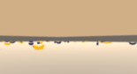

# DRL_Navigation
This project is a part of:  
 [Deep Reinforcement Learning Nanodegree](https://www.udacity.com/course/deep-reinforcement-learning-nanodegree--nd893
 )

The project uses DQN algorithm to solve 'Banana' environment to maximize number of gathered yellow bananas and avoiding blue bananas.



# Requirements
Below you can find a list of requirements required to run train.py & play.py scripts
## Resources
- python 3.6
- Banana app (this is delivered by Udacity Team)
  - Linux: click here
  - Mac OSX: click here
  - Windows (32-bit): click here
  - Windows (64-bit): click here

## Python packages
- torch 
- numpy 
- tqdm
- unityagents

# Usage
## Training
```bash
python3 train.py
```

## Playing usign trained model
```bash
python3 play.py
```

 # Details
Implementation approach & details and metrics can be found in [report](./Report.md) file.
