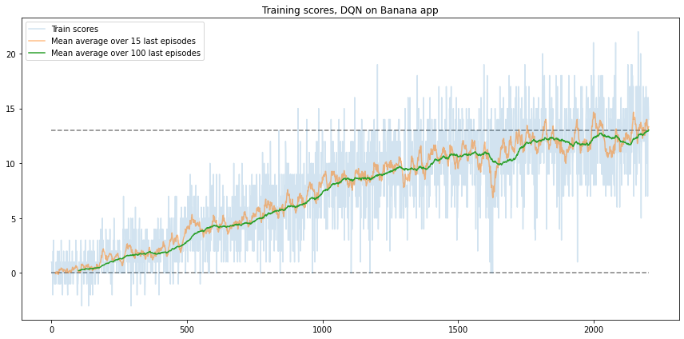
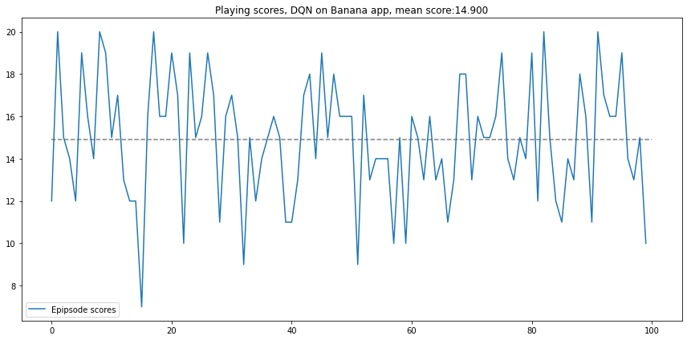

# DQN algorithm
(TODO)
* trial end error, epsilon
* training q function
* two networks

# Approach
(TODO)
* implementation disclaimer
* 4 frames

# Model
(TODO) fully connected Q network

# Training parameters
(TODO)

# Training results
With parameters described above the environment was solved in 2204 episodes.

# Play results
After the network was trained 100 episodes of play were launched achieving average score of 14.7 points.
